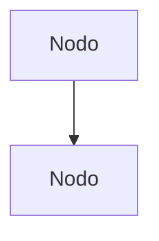

# Curso SQL — Proyecto de Documentación Mintlify

## Onboarding — Inicialización del proyecto

> **Este template está diseñado para ser operado por Claude Code.** El usuario rara vez editará archivos directamente.

Cuando el usuario clone este template y abra una sesión de Claude Code por primera vez, debés ejecutar el **proceso de onboarding** preguntando lo necesario para personalizar el proyecto.

### Qué preguntar al usuario

Antes de tocar cualquier archivo, preguntá al usuario:

1. **Nombre del proyecto** — Se usará en todo el proyecto (docs.json, introduction.mdx, CLAUDE.md, etc.)
2. **Descripción corta** (1-2 oraciones) — Para SEO y subtítulos
3. **Stack tecnológico** — Lenguajes, frameworks, versiones, base de datos
4. **Ruta al código fuente** — Ruta absoluta al repositorio que se va a documentar
5. **Contexto de negocio** — Qué hace el sistema, a quién sirve, qué problema resuelve
6. **Glosario** — Términos específicos del dominio (mínimo 5-10 términos)
7. **Estructura de tabs deseada** — ¿Cuántos tabs? ¿Qué secciones? (sugerir basándose en el tipo de proyecto)
8. **URL de deploy** (si existe) — Para configurar integraciones IA
9. **Colores** — Primary color en hex (o dejar default `#0D9373`)

### Qué hacer con las respuestas

Con la información recopilada, ejecutar **en este orden**:

1. **Reemplazar `[NOMBRE_PROYECTO]`** en todos los archivos del proyecto
2. **Reemplazar `[DESCRIPCION_PROYECTO]`** en todos los archivos
3. **Actualizar `docs.json`**: name, description, colors
4. **Actualizar este `CLAUDE.md`**: completar secciones de Visión general, Stack, Código fuente, Glosario, Conceptos
5. **Reescribir `introduction.mdx`**: con el contexto real del proyecto (stack, negocio, glosario, métricas)
6. **Adaptar `docs.json` navegación**: crear los tabs y dropdowns que el usuario necesita
7. **Eliminar páginas de ejemplo**: borrar `app/documentacion/empezar/ejemplo-seccion/` y las páginas placeholder
8. **Crear las páginas reales**: según la estructura decidida
9. **Actualizar `_workspace/.doc-map/`**: sincronizar todos los archivos del mapa con la nueva estructura
10. **Verificar**: ejecutar `npx mintlify dev` y confirmar que todo carga

### Páginas de ejemplo — Cuándo eliminarlas

Las carpetas `app/documentacion/empezar/ejemplo-seccion/` y `app/procesos/introduction.mdx` contienen **páginas de demostración** con todos los componentes Mintlify. Son referencia para crear páginas nuevas.

- **Conservarlas** mientras se está armando la estructura inicial (sirven como cheat-sheet de componentes)
- **Eliminarlas** una vez que el proyecto tenga al menos 3-4 páginas reales y ya no se necesiten como referencia
- **Al eliminarlas**, quitar también las entradas correspondientes de `docs.json`

---

## Visión general

| Métrica | Valor |
|---------|-------|
| Total páginas | ~16 MDX |
| Tabs | 1 (Documentación) |
| Dropdowns | 5 (Módulos 1-5) |
| Deploy | Pendiente |
| MCP Server | Pendiente |

---

## Audiencia y estándar de calidad

**Dos perfiles objetivo:**
1. **Junior**: Debe dominar cualquier componente leyendo solo la documentación
2. **Senior**: Debe encontrar respuestas rápidas sin abrir código fuente

**Regla fundamental:** Si después de leer la documentación se necesita abrir el código fuente, la documentación es **insuficiente**.

### Nivel de profundidad obligatorio

| Aspecto | Obligatorio | Descripción |
|---------|-------------|-------------|
| **QUÉ hace** | ✅ Siempre | Resumen de 1-2 oraciones |
| **POR QUÉ existe** | ✅ Siempre | Contexto de negocio o técnico |
| **CÓMO funciona** | ✅ Siempre | Flujo paso a paso, snippets, diagramas |
| **DÓNDE encaja** | ✅ Siempre | Relaciones, cross-references |
| **Campos/Estructura** | ✅ Si aplica | Tipos y descripciones |
| **Request/Response** | ✅ Si es endpoint | Formato de datos, errores |
| **Warnings/Bugs** | ✅ Si los hay | Deuda técnica documentada |

### Lo que NUNCA es aceptable

- ❌ Stubs mínimos sin explicar estructura
- ❌ Listar sin explicar qué hace y cómo se usa
- ❌ Modelos sin estructura de tabla
- ❌ Controllers sin request/response
- ❌ Catalogar sin enseñar

---

## Estructura del proyecto

```
proyecto/
├── app/                              # Contenido publicable
│   ├── documentacion/                # Tab Documentación
│   ├── procesos/                     # Tab Procesos
│   └── [otros-tabs]/                 # Tabs adicionales
├── _workspace/                       # Archivos INTERNOS (NO se publican)
│   └── .doc-map/                     # Mapa modular de documentación
├── logo/                             # Logo light/dark
├── docs.json                         # Configuración Mintlify + navegación
├── introduction.mdx                  # Página home
└── CLAUDE.md                         # Este archivo
```

---

## Código fuente del proyecto

```
N/A — Este proyecto documenta un curso de SQL, no un repositorio de código.
```

El contenido fuente proviene del archivo `Resumen SQL.docx`.

---

## Stack tecnológico

Curso teórico-práctico de SQL

| Componente | Versión | Nota |
|------------|---------|------|
| SQL | Estándar | Lenguaje de consultas |
| W3Schools Emulador | WebSQL | Plataforma de práctica |
| Mintlify | Última | Framework de documentación |

---

## Reglas de trabajo

### Comportamiento obligatorio

- **SIEMPRE** pedir aclaraciones antes de asumir
- **NUNCA** inventar información técnica
- **SIEMPRE** leer código fuente real antes de documentar
- **NUNCA** crear archivos MDX sin frontmatter completo
- **SIEMPRE** actualizar `docs.json` al crear/eliminar páginas MDX
- **SIEMPRE** actualizar `_workspace/.doc-map/` al finalizar cada intervención
- **SIEMPRE** verificar que `npx mintlify dev` funciona después de cambios estructurales

### Auto-reporte de eficiencia

Cuando detectes problemas que afecten la calidad, **reportar inmediatamente**:

```
⚠️ ALERTA DE EFICIENCIA

Problema detectado: [descripción]
Impacto: [cómo afecta]
Solución propuesta: [qué hacer]
```

---

## Navegación (docs.json)

**Estructura:** Tab → Dropdowns → Groups → Nested Groups → Pages

**IMPORTANTE:** Dentro de un tab, `groups` y `dropdowns` NO pueden convivir.

### Reglas de segmentación

1. **Nunca listas planas >5 páginas** — usar nested groups
2. **Separar Backend y Frontend** si hay ambos
3. **Sub-grupos de 2-4 páginas** cada uno

### Iconos por capa

| Capa | Icono |
|------|-------|
| Backend | `server` |
| Frontend | `window-maximize` |
| Core/Modelos | `cube` |
| Controllers | `route` |
| Servicios/Jobs | `gears` |
| Auth/Policies | `shield-halved` |
| Configuración | `gear` |
| Instalación | `download` |
| Operación | `play` |
| Referencia | `book` |

### Al agregar una nueva página

1. Crear el archivo `.mdx` con frontmatter completo
2. Agregar la ruta al grupo correspondiente en `docs.json`
3. Verificar que la ruta del filesystem coincide con la ruta en `docs.json`
4. Actualizar el archivo correspondiente en `_workspace/.doc-map/`

### Al crear un nuevo tab

1. Crear la carpeta `app/[nombre-tab]/`
2. Crear `app/[nombre-tab]/introduction.mdx` como página de entrada
3. Agregar el tab completo en `docs.json` (con al menos un dropdown y un group)
4. Crear `_workspace/.doc-map/[nombre-tab].md` para el índice del tab
5. Actualizar `_workspace/.doc-map/_index.md` (tabla de estructura y resumen)
6. Actualizar `_workspace/.doc-map/navegacion.md` con el nuevo tab

---

## Formato MDX

### Frontmatter obligatorio

```yaml
---
title: "Título claro"
description: "Resumen 120-160 caracteres (crítico para llms.txt)"
icon: "icono-fontawesome"  # Opcional pero recomendado
---
```

### Componentes Mintlify más usados

| Componente | Uso |
|------------|-----|
| `<Note>`, `<Warning>`, `<Tip>` | Callouts informativos |
| `<Steps>` + `<Step>` | Procesos secuenciales |
| `<Tabs>` + `<Tab>` | Alternar versiones/opciones |
| `<Accordion>` | Contenido colapsable |
| `<CardGroup>` + `<Card>` | Navegación visual |
| `<AccordionGroup>` | Grupo de accordions |
| `<Frame>` | Imágenes con caption |

> **Referencia**: Consultar la documentación oficial de Mintlify para componentes adicionales.

### Diagramas — Mermaid obligatorio

**NUNCA** usar ASCII art. **SIEMPRE** usar Mermaid:



**Regla de densidad:** Máximo ~12 nodos por diagrama. Si necesitás más, dividí en múltiples diagramas.

---

## Mapa de documentación (`_workspace/.doc-map/`)

Sistema modular para mantener coherencia a lo largo de toda la documentación.

### Archivos y cuándo usarlos

| Archivo | Contenido | Cuándo consultar |
|---------|-----------|------------------|
| `_index.md` | Cambios recientes, stats, stack | **Al inicio de cada sesión** |
| `navegacion.md` | Estructura tabs/dropdowns/groups | Al modificar docs.json |
| `documentacion.md` | Índice Tab Documentación | Al trabajar en ese tab |
| `procesos.md` | Índice Tab Procesos | Al trabajar en ese tab |
| `conexiones.md` | Cross-references entre archivos | Al decidir enlaces |
| `conceptos.md` | Conceptos compartidos | Al modificar conceptos transversales |

> **Agregar más archivos** cuando se creen nuevos tabs (ej: `auditoria.md`, `desarrollo.md`).

### Reglas de mantenimiento

- **`_index.md`** — "Cambios recientes" se **REEMPLAZA** (no acumular)
- **Actualizar** archivos afectados al finalizar cada intervención
- **Consultar** solo el archivo necesario (no leer todo)

---

## Conceptos técnicos clave

Mantener coherencia al modificar estos conceptos:

| Concepto | Descripción | Ver detalles |
|----------|-------------|--------------|
| PK/FK | Claves primarias y foráneas | `_workspace/.doc-map/conceptos.md` |
| JOINs | Tipos de JOIN y cuándo usar cada uno | `_workspace/.doc-map/conceptos.md` |
| DDL/DML | Categorías de comandos SQL | `_workspace/.doc-map/conceptos.md` |
| Integridad referencial | Consistencia entre tablas relacionadas | `_workspace/.doc-map/conceptos.md` |
| Subconsultas | SELECTs anidados en WHERE, columna o FROM | `_workspace/.doc-map/conceptos.md` |

---

## Cross-references

### Cuándo agregar

1. **Complemento directo**: La otra página completa la información
2. **Prerrequisito**: Se necesita leer primero la otra página
3. **Profundización**: Para quien quiera más detalle
4. **Operación ↔ Técnica**: Conectar procesos con documentación técnica

### Cuándo NO agregar

1. **Forzado**: No hay relación real
2. **Repetido**: Ya existe en la misma página
3. **Obvio**: La navegación ya lo conecta (mismo dropdown)

### Formato

```mdx
<Tip>
Para más detalle, consultá [Título página](/ruta/pagina).
</Tip>
```

---

## Glosario institucional

| Término | Significado |
|---------|-------------|
| BDD | Base de datos |
| RDBM | Sistema de gestión de bases de datos relacional |
| DBMS | Database Management System |
| DDL | Data Definition Language (CREATE, ALTER, DROP) |
| DML | Data Manipulation Language (INSERT, UPDATE, DELETE, SELECT) |
| PK | Primary Key — Clave primaria |
| FK | Foreign Key — Clave foránea |
| JOIN | Operación que combina filas de dos o más tablas |
| Tupla | Fila o registro de una tabla |
| Collation | Reglas de comparación de cadenas de texto |

---

## Integraciones IA configuradas

[COMPLETAR: URLs de integración IA cuando el proyecto esté desplegado]

| Servicio | URL/Comando |
|----------|-------------|
| **llms.txt** | [URL]/llms.txt |
| **llms-full.txt** | [URL]/llms-full.txt |
| **MCP Server** | [URL]/mcp |
| **Claude Code** | `claude mcp add --transport http [nombre] [URL]/mcp` |

---

## Referencias

- [Mintlify Docs](https://mintlify.com/docs)
- [Componentes Mintlify](https://mintlify.com/docs/components)
- [Mermaid Diagrams](https://mermaid.js.org)
