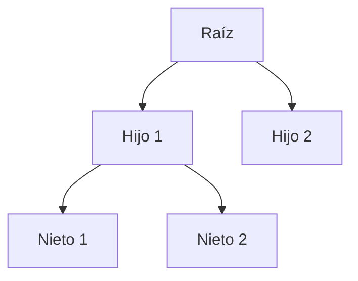

## Datos e información

Los **datos** son hechos sin procesar ni organizar. Pueden ser:

| Tipo | Ejemplo |
|------|---------|
| Alfanuméricos | `A1B2C3` |
| Alfabéticos | `Juan`, `María` |
| Numéricos | `42`, `3.14` |
| Imágenes | Fotos, gráficos |
| Audio | Grabaciones, música |
| Video | Clips, películas |
| Multimedia | Combinación de los anteriores |

Cuando los datos se **organizan**, se convierten en **información**.

<Note>
Una **base de datos** es una colección organizada de datos de forma sistemática para su consulta.
</Note>

## Modelos de bases de datos

### Fichero plano

La forma más simple de almacenamiento. Los datos se guardan en un archivo de texto sin estructura formal.

### Jerárquico

Almacena tablas jerárquicamente relacionadas entre sí con relaciones **padre-hijo** en una estructura de árbol.

### En red

Similar al jerárquico, pero las tablas pueden tener **más de un padre**, formando una estructura de red.

### Relacional (RDBM)

El modelo **más utilizado hoy en día**. Los datos se almacenan en **tablas relacionadas entre sí**, organizadas en filas y columnas.

### Orientado a objetos (OODBM)

Los datos se almacenan como **objetos** (los campos son atributos). Las clases describen objetos similares y se organizan en una jerarquía de clases como en programación orientada a objetos (OOP), donde los hijos heredan las características del padre.

### Híbrido (ORDBMS)

Bases de datos **relacionales** que también están **orientadas a objetos**. Combinan lo mejor de ambos modelos.

## Bases de datos relacionales

El modelo que más se usa y el foco de este curso. El elemento básico son las **tablas**, organizadas en filas y columnas (también llamadas **relaciones**) que guardan datos de un tipo de entidad.

### Componentes fundamentales

| Componente | Definición | Analogía |
|------------|-----------|----------|
| **Tabla** | Conjunto de registros relacionados con un tipo de entidad | Una hoja de Excel |
| **Campo** | Atributo de las entidades, se guarda en una **columna** | Una columna del Excel |
| **Registro (Tupla)** | Fila de la tabla, datos concretos de una entidad | Una fila del Excel |
| **Dato** | Valor dentro de una celda | El contenido de una celda |

### Ejemplo concreto

| Concepto | En la base de datos | Ejemplo |
|----------|-------------------|---------|
| Entidad | Tabla | `Cliente`, `Mascota`, `Turno` |
| Registro | Una fila | Un cliente específico |
| Campo | Una columna | `nombre`, `DNI`, etc. |
| Dato | Valor en una celda | `"Nicolás"` |

### Para definir un campo necesitamos

<Steps>
  <Step title="Nombre">
    El identificador del campo (ej: `nombre`, `edad`, `email`)
  </Step>
  <Step title="Tipo de dato">
    Numérico, alfanumérico, imagen, etc.
  </Step>
  <Step title="Tamaño">
    Longitud o tamaño máximo permitido
  </Step>
  <Step title="Formato">
    Reglas o restricciones del campo (ej: no nulo, único)
  </Step>
</Steps>
