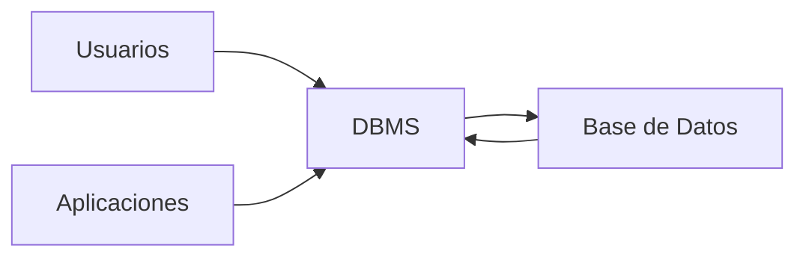
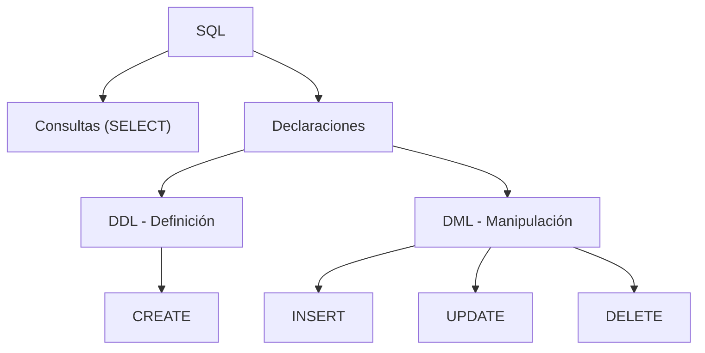

## Sistemas de gestión de bases de datos (DBMS)

Un **DBMS** (Database Management System) es un software que **interactúa con usuarios, otras aplicaciones y con la base de datos** para insertar y extraer datos.



### Qué te permite un DBMS

<Tabs>
  <Tab title="Crear">
    - Modelado de bases de datos
    - Definición de tablas y relaciones
  </Tab>
  <Tab title="Mantener">
    - Administración
    - Almacenamiento
    - Seguridad y privacidad
    - Integridad de datos
  </Tab>
  <Tab title="Analizar">
    - Consulta de datos
    - Creación de informes
  </Tab>
  <Tab title="Manipular">
    - Inserción de registros
    - Edición de registros
    - Borrado de registros
  </Tab>
</Tabs>

### Capacidades adicionales del DBMS

| Capacidad | Descripción |
|-----------|-------------|
| **BDD distribuidas** | Puede aparentar ser una sola base de datos estando distribuida en varios lugares |
| **Redundancia** | Manejo de copias de datos para seguridad |
| **Multiusuario** | Acceso concurrente de múltiples usuarios |
| **Normalización** | Organización eficiente de los datos |
| **Gestión compleja** | Bloqueos, permisos, transacciones |

### Tipos de bases de datos

| Tipo | Uso principal |
|------|---------------|
| **Relacional** | El más común, tablas con filas y columnas |
| **Orientadas a objetos** | Mejor para multimedia y datos complejos |
| **Híbrido** | Combina relacional con orientación a objetos |

## El lenguaje SQL

**SQL** (Structured Query Language) es el lenguaje utilizado en la mayoría de las grandes bases de datos: Oracle, MySQL, MariaDB, PostgreSQL, SQL Server.

<Note>
SQL **no es procedimental** — especificás lo que querés y el programa te lo devuelve. No necesitás decir *cómo* hacerlo.
</Note>

Se compone de **cláusulas** que pueden ser **consultas** o **declaraciones**.

### Tipos de comandos SQL



| Categoría | Comandos | Función |
|-----------|----------|---------|
| **Consultas** | `SELECT` | Extraer datos |
| **DDL** (Definición) | `CREATE` | Crear bases de datos y tablas |
| **DML** (Manipulación) | `INSERT` | Insertar registros |
| | `UPDATE` | Actualizar registros |
| | `DELETE` | Borrar registros |

### Primeros ejemplos

#### DELETE — Borrar registros

```sql
DELETE FROM STUDENT
WHERE StudentID = '1234';
```

#### UPDATE — Actualizar registros

```sql
UPDATE STUDENT
SET Age = '26'
WHERE StudentID = '1125';
```

#### INSERT — Insertar registros

```sql
INSERT INTO STUDENT
VALUES (1464, 'Tania Fox', '4 Park Drive', 'Amsterdam', 'NY', '09876', 22);
```

#### SELECT — Consultar registros

```sql
-- Todos los estudiantes de Nutley
SELECT *
FROM STUDENT
WHERE City = 'Nutley';

-- Estudiantes de Nutley con 21 años
SELECT *
FROM STUDENT
WHERE City = 'Nutley' AND Age = '21';

-- Estudiantes de Nutley O menores de 21
SELECT *
FROM STUDENT
WHERE City = 'Nutley' OR Age < '21';
```

<Tip>
Para profundizar en SELECT y filtrado, continuá con [SELECT y Filtrado de Datos](/app/documentacion/modulo-2/select-filtrado).
</Tip>
