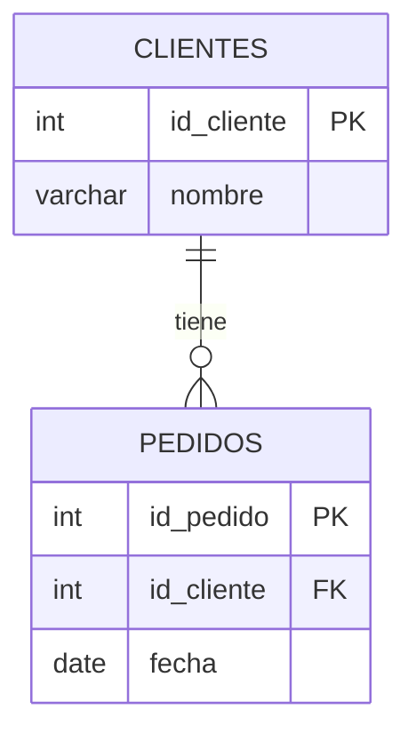
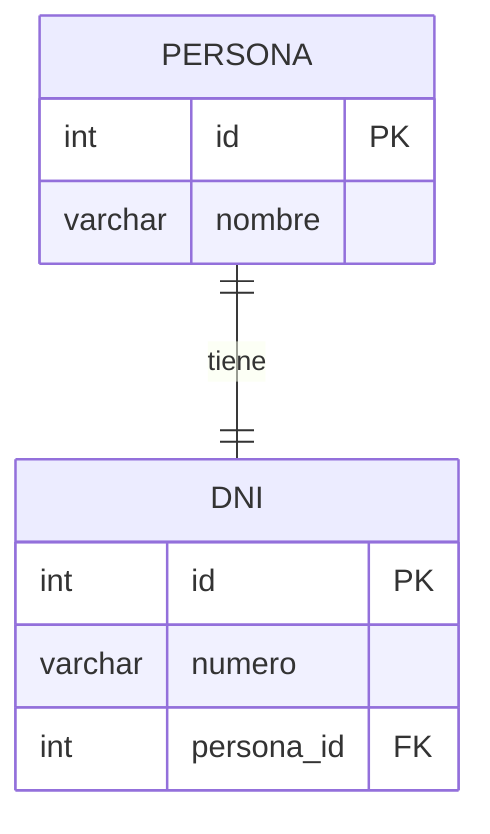
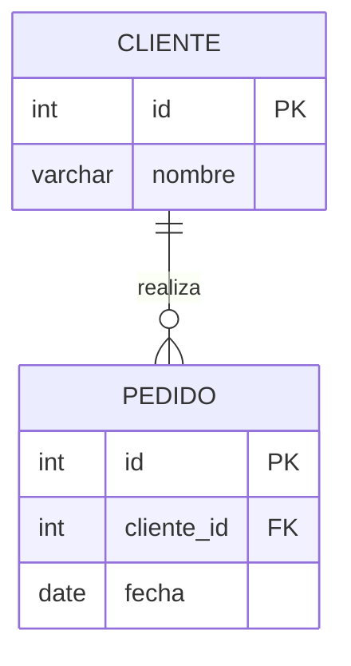
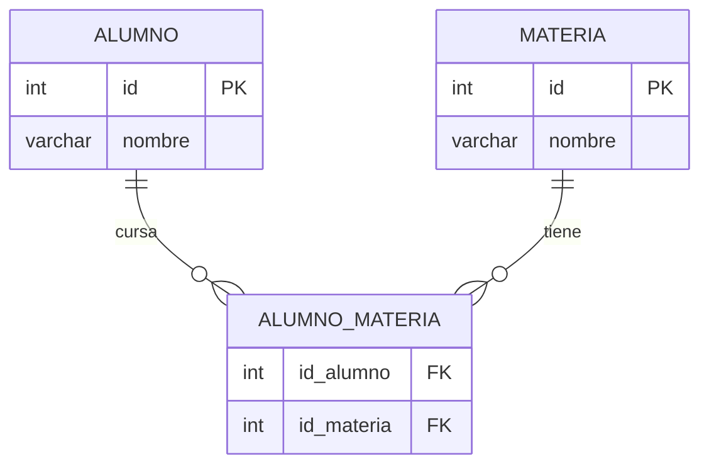

## Claves en bases de datos relacionales

Las claves son campos especiales que permiten **identificar registros** y **crear relaciones** entre tablas.

### Clave primaria (Primary Key / PK)

Es el campo (o conjunto de campos) que identifica de forma **única** cada fila de una tabla.

<Warning>
- **No se repite** — Cada valor de PK es único en toda la tabla
- **No debería ser nula** — Siempre debe tener un valor
</Warning>

**Ejemplo:** En la tabla `Clientes`, el campo `id_cliente` identifica a cada cliente de manera única.

### Clave foránea (Foreign Key / FK)

Es un campo que apunta a la **clave primaria de otra tabla** para crear una relación entre ellas.

- **Puede repetirse** — Muchos registros pueden apuntar al mismo valor
- Sirve para mantener la **integridad referencial** (que no existan relaciones "inventadas")

**Ejemplo:** En la tabla `Pedidos`, el campo `id_cliente` es una FK que referencia a `Clientes.id_cliente`.

### Ejemplo completo

```sql
-- Tabla Clientes
Clientes: id_cliente (PK), nombre

-- Tabla Pedidos
Pedidos: id_pedido (PK), id_cliente (FK), fecha
```

Así, cada pedido queda asociado a un cliente real.



## Tipos de relaciones entre entidades

### 1) Uno a Uno (1:1)

Una entidad se relaciona con **una sola** de la otra, y viceversa.

**Ejemplo:** `Persona` ↔ `DNI`
- Una persona tiene un DNI y un DNI pertenece a una persona.

**Implementación:** Una FK con `UNIQUE` o compartir la misma PK.



### 2) Uno a Muchos (1:N)

Una entidad puede tener **muchas** del otro lado, pero del otro lado cada una pertenece a **una sola**.

**Ejemplo:** `Cliente` → `Pedidos`
- Un cliente puede tener muchos pedidos, pero cada pedido es de un solo cliente.

**Implementación:** La FK va en la tabla del "muchos" (`Pedidos` tiene `id_cliente`).



### 3) Muchos a Muchos (N:M)

Muchas entidades se relacionan con **muchas** del otro lado.

**Ejemplo:** `Alumno` ↔ `Materia`
- Un alumno cursa muchas materias y una materia la cursan muchos alumnos.

**Implementación:** Se crea una **tabla intermedia** (o "tabla puente"):

```sql
Alumno_Materia(id_alumno FK, id_materia FK, ...)
```



## Resumen de relaciones

| Tipo | Descripción | Implementación |
|------|------------|---------------|
| **1:1** | 1 con 1 | FK con UNIQUE o PK compartida |
| **1:N** | 1 con varios | FK en la tabla de "varios" |
| **N:M** | Varios con varios | Tabla intermedia con dos FK |

<Tip>
Para más detalle sobre cómo crear estas relaciones en SQL, consultá [CREATE, ALTER y DROP](/app/documentacion/modulo-2/ddl).
</Tip>
