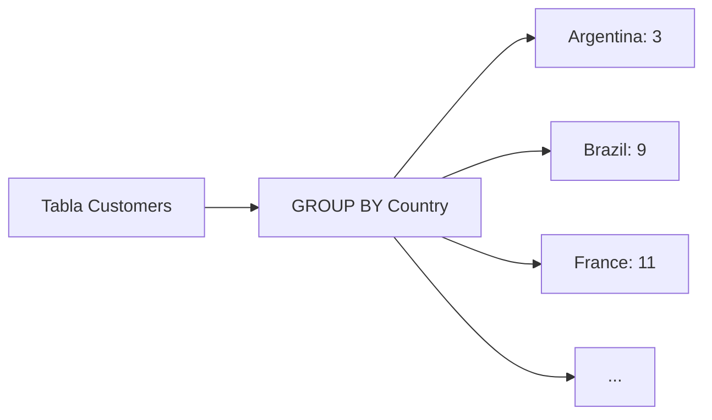
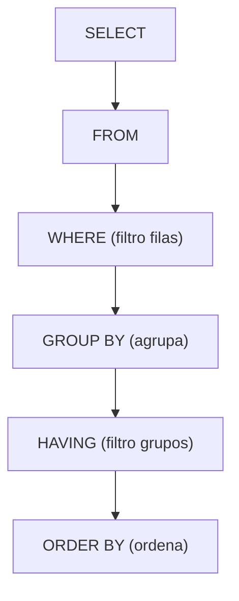

## ORDER BY — Ordenar resultados

`ORDER BY` ordena los resultados de una consulta por una o más columnas.

### Orden ascendente (por defecto)

```sql
SELECT EmployeeID, LastName, FirstName
FROM Employees
ORDER BY LastName;
```

Por defecto, siempre muestra en forma **ascendente** (A→Z, 1→99).

### Orden descendente

```sql
SELECT EmployeeID, LastName, FirstName
FROM Employees
ORDER BY LastName DESC;
```

### Ordenar por número de columna

```sql
SELECT EmployeeID, LastName, FirstName
FROM Employees
ORDER BY 2;
```

Ordena por la **columna 2** de las seleccionadas (en este caso, `LastName`).

### Ordenar por varias columnas

```sql
SELECT EmployeeID, LastName, FirstName
FROM Employees
ORDER BY LastName, FirstName;
```

Primero ordena por apellido; si hay empate, desempata por nombre.

### Combinar BETWEEN con ORDER BY

```sql
SELECT * FROM Products
WHERE ProductName BETWEEN 'Ikura' AND 'Konbu'
ORDER BY ProductName;
```

## GROUP BY — Agrupar resultados

`GROUP BY` agrupa filas que tienen el mismo valor en una columna y permite aplicar **funciones agregadas** sobre cada grupo.

```sql
SELECT Country, COUNT(Country) AS CountCountry
FROM Customers
GROUP BY Country
ORDER BY Country;
```

Cuenta cuántos clientes hay por cada país, agrupados y ordenados alfabéticamente.



## HAVING — Filtrar grupos

`HAVING` filtra los resultados **después de agrupar**. Es el equivalente a `WHERE` pero para grupos.

```sql
SELECT Country, COUNT(Country) AS CountCountry
FROM Customers
GROUP BY Country
HAVING CountCountry >= 5
ORDER BY CountCountry DESC;
```

Selecciona solo los países que tienen **5 o más clientes**, ordenados de mayor a menor.

<Note>
**WHERE** filtra filas individuales **antes** de agrupar. **HAVING** filtra grupos **después** de agrupar. No son intercambiables.
</Note>

### Orden de las cláusulas



## SELECT CASE — Clasificar registros

`CASE` permite crear un **campo calculado** que clasifica los registros según condiciones.

### Ejemplo: Agrupar productos por precio

```sql
SELECT *,
    CASE
        WHEN Price <= 10 THEN 'Grupo 1'
        WHEN Price > 10 AND Price <= 50 THEN 'Grupo 2'
        WHEN Price > 50 AND Price <= 100 THEN 'Grupo 3'
        WHEN Price > 100 AND Price <= 200 THEN 'Grupo 4'
        ELSE 'Grupo 5'
    END AS GrupoPrecio
FROM Products;
```

Esto crea un **campo nuevo** llamado `GrupoPrecio` que clasifica cada producto según su precio.

### Cómo funciona

| Condición | Resultado |
|-----------|-----------|
| Precio ≤ 10 | Grupo 1 |
| 10 < Precio ≤ 50 | Grupo 2 |
| 50 < Precio ≤ 100 | Grupo 3 |
| 100 < Precio ≤ 200 | Grupo 4 |
| Precio > 200 | Grupo 5 |

<Tip>
`CASE` es muy útil combinado con `GROUP BY` para contar cuántos registros hay en cada grupo. Esto se explora en el [Módulo 5 — Consultas Avanzadas](/app/documentacion/modulo-5/consultas-avanzadas).
</Tip>

## Resumen de cláusulas

| Cláusula | Función | Se aplica a |
|----------|---------|-------------|
| `ORDER BY` | Ordenar resultados | Filas del resultado |
| `GROUP BY` | Agrupar filas con mismo valor | Columnas |
| `HAVING` | Filtrar después de agrupar | Grupos |
| `CASE` | Clasificar registros en categorías | Campo calculado |
