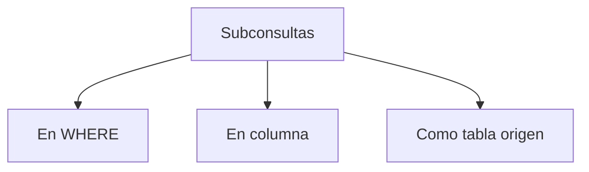

## Qué es una subconsulta

Una **subconsulta** (o subquery) es un `SELECT` dentro de otro `SELECT`. Se usa cuando necesitás que el resultado de una consulta sea parte de otra.

Existen tres formas principales de usar subconsultas:



## Subconsultas en WHERE

La subconsulta se usa dentro del `WHERE` para filtrar según un valor calculado dinámicamente.

### Ejemplo: Registro con el valor máximo

```sql
SELECT * FROM OrderDetails
WHERE Quantity = (SELECT MAX(Quantity) FROM OrderDetails);
```

Selecciona todos los registros donde la cantidad es igual al **máximo** de toda la tabla. La subconsulta `(SELECT MAX(Quantity) FROM OrderDetails)` se ejecuta primero y su resultado se usa como filtro.

### Ejemplo: Filtrar con IN y subconsulta

```sql
SELECT * FROM Orders
WHERE EmployeeID IN (
    SELECT EmployeeID FROM Employees
    WHERE LastName IN ('Davolio', 'Fuller')
);
```

Selecciona todas las órdenes hechas por empleados cuyo apellido sea "Davolio" o "Fuller". La subconsulta obtiene primero los IDs de esos empleados.

## Subconsultas en columna

La subconsulta se usa como un **campo calculado** adicional en el SELECT.

```sql
SELECT
    OrderID,
    Quantity,
    (SELECT MAX(Quantity) FROM OrderDetails) AS MAXQuantity
FROM OrderDetails;
```

Cada fila muestra su propia cantidad junto con la **cantidad máxima** de toda la tabla como referencia.

| OrderID | Quantity | MAXQuantity |
|---------|----------|-------------|
| 10248 | 12 | 130 |
| 10248 | 10 | 130 |
| 10249 | 9 | 130 |

## Subconsultas como tabla origen

La subconsulta se usa en el `FROM` como si fuera una **tabla temporal**. Esta es la forma más poderosa y compleja.

```sql
SELECT MAX(Items) AS Maximum
FROM (
    SELECT COUNT(OrderID) AS Items
    FROM OrderDetails
    GROUP BY OrderID
) AS ItemsPerOrder;
```

<Steps>
  <Step title="Subconsulta interna">
    Cuenta cuántos ítems tiene cada orden (`COUNT` + `GROUP BY`)
  </Step>
  <Step title="Consulta externa">
    Sobre esos resultados, obtiene el **máximo** de ítems por orden
  </Step>
</Steps>

<Note>
Cuando una subconsulta se usa como tabla origen, **siempre debe tener un alias** (en este caso, `AS ItemsPerOrder`). Sin el alias, la consulta dará error.
</Note>

## Resumen de usos

| Uso | Ubicación | Ejemplo |
|-----|-----------|---------|
| **Filtro** | En `WHERE` | `WHERE campo = (SELECT ...)` |
| **Columna calculada** | En `SELECT` | `SELECT ..., (SELECT ...) AS alias` |
| **Tabla temporal** | En `FROM` | `FROM (SELECT ...) AS alias` |

<Warning>
Las subconsultas pueden afectar el rendimiento si se usan en exceso o si la subconsulta interna procesa muchos datos. En esos casos, considerá usar **JOINs** como alternativa.
</Warning>

<Tip>
Para aprender a combinar datos de múltiples tablas de forma eficiente, continuá con [Tipos de JOIN](/app/documentacion/modulo-4/tipos-join).
</Tip>
