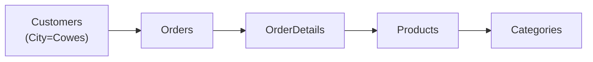

## Ejercicios resueltos

<Note>
Estos ejercicios usan el emulador SQL de W3Schools. Las tablas disponibles: Customers, Products, Suppliers, Orders, OrderDetails, Employees, Categories, Shippers.
</Note>

---

### Ejercicio 1 — Ventas totales de un producto

**Consigna:** Calculá la suma total de ventas (Price × Quantity) del producto "Steeleye Stout".

<Accordion title="Solución">

```sql
SELECT SUM(p.Price * od.Quantity) AS TotalVentas
FROM Products p
JOIN OrderDetails od ON od.ProductID = p.ProductID
WHERE p.ProductName = 'Steeleye Stout';
```

**Respuesta: 6642**

Se usa un `JOIN` entre Products y OrderDetails para cruzar precio y cantidad, y `SUM` para obtener el total.

</Accordion>

---

### Ejercicio 2 — Ventas totales de un cliente

**Consigna:** Calculá la suma total de ventas al cliente "Princesa Isabel Vinhoss".

<Accordion title="Solución">

Primero identificamos el CustomerID:

```sql
SELECT CustomerID, CustomerName
FROM Customers
WHERE CustomerName = 'Princesa Isabel Vinhoss';
-- CustomerID = 60
```

Luego calculamos las ventas:

```sql
SELECT SUM(p.Price * od.Quantity) AS TotalVentas
FROM Orders o
JOIN OrderDetails od ON od.OrderID = o.OrderID
JOIN Products p ON p.ProductID = od.ProductID
WHERE o.CustomerID = 60;
```

**Respuesta: 2514**

Se necesitan **3 tablas**: Orders (para filtrar por cliente), OrderDetails (cantidad) y Products (precio).

</Accordion>

---

### Ejercicio 3 — Ventas totales de un suministrador

**Consigna:** Calculá la suma total de ventas del suministrador "Leka Trading".

<Accordion title="Solución">

```sql
SELECT SUM(p.Price * od.Quantity) AS TotalVentas
FROM Suppliers s
JOIN Products p ON p.SupplierID = s.SupplierID
JOIN OrderDetails od ON od.ProductID = p.ProductID
WHERE s.SupplierName = 'Leka Trading';
```

**Respuesta: 10796.1**

Cadena de JOINs: Suppliers → Products → OrderDetails.

</Accordion>

---

### Ejercicio 4 — Ventas por categoría de un suministrador

**Consigna:** Calculá las ventas totales por categoría del suministrador "Karkki Oy" y encontrá la categoría con máximas ventas.

<Accordion title="Solución">

```sql
SELECT c.CategoryName,
       SUM(p.Price * od.Quantity) AS TotalVentas
FROM Suppliers s
JOIN Products p ON p.SupplierID = s.SupplierID
JOIN Categories c ON c.CategoryID = p.CategoryID
JOIN OrderDetails od ON od.ProductID = p.ProductID
WHERE s.SupplierName = 'Karkki Oy'
GROUP BY c.CategoryName
ORDER BY TotalVentas DESC
LIMIT 1;
```

**Respuesta: 4737.5**

Se agrupan por categoría con `GROUP BY`, se ordenan de mayor a menor y se toma el primero con `LIMIT 1`.

</Accordion>

---

### Ejercicio 5 — Ventas por categoría en una ciudad

**Consigna:** Calculá las ventas totales por categoría enviadas a la ciudad "Cowes" (ciudad del cliente) y encontrá la categoría con máximas ventas.

<Accordion title="Solución">

```sql
SELECT c.CategoryName,
       SUM(p.Price * od.Quantity) AS TotalVentas
FROM Customers cu
JOIN Orders o ON o.CustomerID = cu.CustomerID
JOIN OrderDetails od ON od.OrderID = o.OrderID
JOIN Products p ON p.ProductID = od.ProductID
JOIN Categories c ON c.CategoryID = p.CategoryID
WHERE cu.City = 'Cowes'
GROUP BY c.CategoryName
ORDER BY TotalVentas DESC
LIMIT 1;
```

**Respuesta: 934**

Cadena de 5 tablas: Customers → Orders → OrderDetails → Products → Categories. Se filtra por ciudad del cliente y se agrupa por categoría.



</Accordion>
