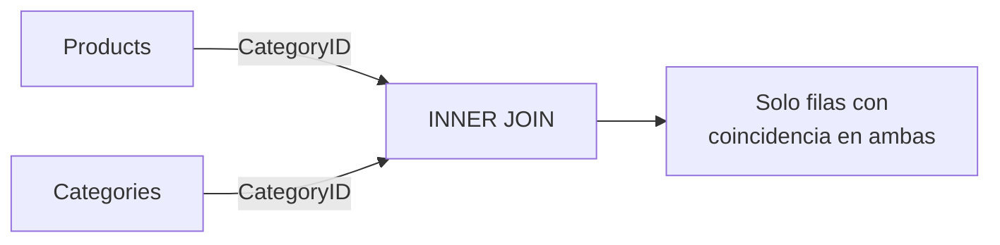

## Qué es un JOIN

Un **JOIN** se usa cuando necesitás combinar datos de dos o más tablas que están relacionadas, para verlos en un mismo resultado. La idea base es que una tabla tiene información "principal" y otra tiene información "relacionada", y las unís por un **campo en común** (normalmente una PK con una FK).

### Casos típicos de uso

| Caso | Ejemplo |
|------|---------|
| **Datos completos** | En `Orders` tenés `CustomerID`, pero querés ver el nombre del cliente |
| **Tablas detalle** | Una orden tiene varias líneas en `OrderDetails` |
| **Filtrar por otra tabla** | Órdenes hechas por clientes de USA (Country está en Customers) |
| **Calcular totales** | Total facturado por orden cruzando Price y Quantity |

## JOIN implícito (CROSS JOIN)

Al listar tablas separadas por coma sin condición, se genera un **producto cartesiano**: cada fila de una tabla se combina con todas las filas de la otra.

```sql
SELECT * FROM Products, Categories;
```

<Warning>
Sin relación, para 77 productos con 8 categorías se generan **616 registros** (77 × 8). Esto rara vez es útil.
</Warning>

### JOIN implícito con relación

Agregando un `WHERE` que vincule las tablas, se obtiene un resultado útil:

```sql
SELECT * FROM Products, Categories
WHERE Products.CategoryID = Categories.CategoryID;
```

### Con alias (para nombres largos)

```sql
SELECT P.ProductName, C.CategoryName
FROM Products P, Categories C
WHERE P.CategoryID = C.CategoryID;
```

### JOIN implícito entre varias tablas

```sql
SELECT O.*, ProductName, C.CategoryName
FROM OrderDetails O, Products P, Categories C
WHERE O.ProductID = P.ProductID
  AND P.CategoryID = C.CategoryID;
```

<Note>
El JOIN implícito funciona correctamente si la **integridad referencial** de las tablas está bien implementada y todos los registros tienen relaciones válidas.
</Note>

## INNER JOIN

Trae **solo las filas donde hay coincidencia** en ambas tablas. Es el JOIN más común.

```sql
SELECT P.ProductName, C.CategoryName
FROM Products P
INNER JOIN Categories C ON P.CategoryID = C.CategoryID;
```



### Ejemplo con Employees y SalesObjectives

```sql
SELECT E.EmployeeID, E.LastName, E.FirstName, S.Sales, S.Year
FROM Employees E
INNER JOIN SalesObjectives S ON E.EmployeeID = S.EmployeeID;
```

Si un empleado no tiene objetivos de ventas, **no aparece** en el resultado.

## LEFT JOIN

Trae **todo de la tabla izquierda** aunque no tenga coincidencia en la derecha. Donde no hay coincidencia, los campos de la tabla derecha aparecen como `NULL`.

```sql
SELECT E.EmployeeID, E.LastName, E.FirstName, S.Sales, S.Year
FROM Employees E
LEFT JOIN SalesObjectives S ON E.EmployeeID = S.EmployeeID;
```

Muestra los **10 empleados**, aunque solo 2 tengan objetivos de ventas. Los demás aparecen con `NULL` en Sales y Year.

### Encontrar registros sin relación

```sql
SELECT E.EmployeeID, E.LastName, E.FirstName, S.Sales, S.Year
FROM Employees E
LEFT JOIN SalesObjectives S ON E.EmployeeID = S.EmployeeID
WHERE S.EmployeeID IS NULL;
```

Trae solo los empleados que **no tienen** objetivos de ventas asignados.

## RIGHT JOIN

Trae **todo de la tabla derecha** aunque no tenga coincidencia en la izquierda.

```sql
SELECT E.EmployeeID, E.LastName, E.FirstName, S.Sales, S.Year
FROM Employees E
RIGHT JOIN SalesObjectives S ON E.EmployeeID = S.EmployeeID;
```

Solo trae registros que tengan datos en la tabla de la derecha (`SalesObjectives`).

## FULL OUTER JOIN

Trae **todo de ambos lados**, coincidan o no.

<Note>
MySQL no soporta `FULL OUTER JOIN` directamente. Se puede simular con `LEFT JOIN` + `UNION` + `RIGHT JOIN`.
</Note>

## Resumen visual

| Tipo | Qué trae | Tabla izquierda | Tabla derecha |
|------|----------|-----------------|---------------|
| **INNER JOIN** | Solo coincidencias | Parcial | Parcial |
| **LEFT JOIN** | Todo de la izquierda | Completa | Parcial + NULL |
| **RIGHT JOIN** | Todo de la derecha | Parcial + NULL | Completa |
| **FULL OUTER** | Todo de ambos | Completa + NULL | Completa + NULL |

### Cuándo usar cada tipo

| Necesidad | JOIN a usar |
|-----------|-------------|
| Queremos **todos los productos aunque no tengan categoría** | `LEFT JOIN` desde Products |
| Solo queremos productos **con categoría asignada** | `INNER JOIN` |
| Queremos **todas las categorías aunque no tengan productos** | `RIGHT JOIN` desde Products |
| Queremos **todo de ambos lados** | `FULL OUTER JOIN` |

<Tip>
Para combinar más de dos tablas en un solo query, consultá [JOINs Multitabla y UNION](/app/documentacion/modulo-4/join-multitabla-union).
</Tip>
