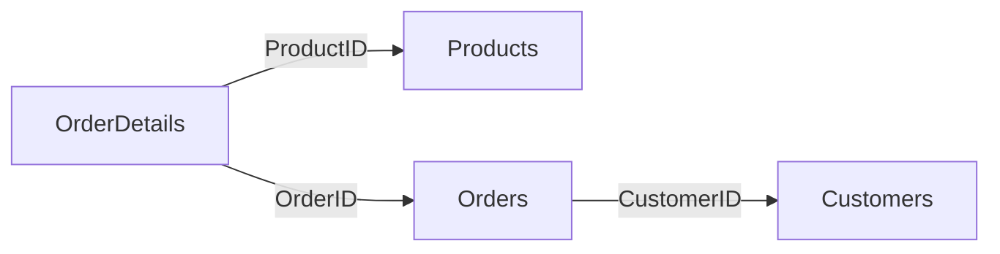

## Subconsultas como origen con JOINs

En este módulo combinamos todo lo aprendido: **subconsultas, JOINs, funciones agregadas, GROUP BY y CASE** para resolver consultas complejas de análisis de datos.

## Total por cada orden

Calculamos el total de cada orden sumando las líneas de detalle.

```sql
SELECT OrderID, SUM(Total) AS OrderTotal
FROM (
    SELECT O.OrderDetailID, O.OrderID,
           O.Quantity * P.Price AS Total
    FROM OrderDetails O
    INNER JOIN Products P ON P.ProductID = O.ProductID
) AS OrderDetailsWithPrice
GROUP BY OrderID;
```

<Steps>
  <Step title="Subconsulta interna">
    Calcula el total de cada línea (Quantity × Price) uniendo OrderDetails con Products
  </Step>
  <Step title="Consulta externa">
    Agrupa por OrderID y suma todos los totales de sus líneas
  </Step>
</Steps>

## Total por línea de orden con cliente

Expandimos la consulta anterior agregando el nombre del cliente.

```sql
SELECT OD.OrderDetailID, O.OrderID, C.CustomerName,
       OD.Quantity * P.Price AS Total
FROM OrderDetails OD
LEFT JOIN Products P ON P.ProductID = OD.ProductID
LEFT JOIN Orders O ON OD.OrderID = O.OrderID
LEFT JOIN Customers C ON O.CustomerID = C.CustomerID;
```



Cada fila muestra: detalle de orden, número de orden, nombre del cliente y el total de esa línea.

## Top 5 suministradores que más negocio generan

```sql
SELECT SupplierName, Country,
       ROUND(SUM(Total)) AS SupplierTotal
FROM (
    SELECT S.SupplierName, S.Country,
           O.Quantity * P.Price AS Total
    FROM OrderDetails O
    LEFT JOIN Products P ON P.ProductID = O.ProductID
    LEFT JOIN Suppliers S ON P.SupplierID = S.SupplierID
) AS OrderDetailsWithPrice
GROUP BY SupplierName
ORDER BY SupplierTotal DESC
LIMIT 5;
```

Combina:
- **Subconsulta**: calcula el total por línea incluyendo datos del suministrador
- **Consulta externa**: agrupa por suministrador, suma y ordena de mayor a menor
- **LIMIT 5**: muestra solo los 5 primeros

## Número de productos por grupo de precios

Combinamos `CASE` con `GROUP BY` usando la subconsulta como tabla origen.

```sql
SELECT GrupoPrecio, COUNT(GrupoPrecio) AS Numero_de_Productos
FROM (
    SELECT *,
        CASE
            WHEN Price <= 10 THEN 'Grupo 1'
            WHEN Price > 10 AND Price <= 50 THEN 'Grupo 2'
            WHEN Price > 50 AND Price <= 100 THEN 'Grupo 3'
            WHEN Price > 100 AND Price <= 200 THEN 'Grupo 4'
            ELSE 'Grupo 5'
        END AS GrupoPrecio
    FROM Products
) AS ConGrupos
GROUP BY GrupoPrecio;
```

<Steps>
  <Step title="CASE en subconsulta">
    Clasifica cada producto en un grupo de precio
  </Step>
  <Step title="GROUP BY + COUNT">
    Cuenta cuántos productos hay en cada grupo
  </Step>
</Steps>

## Total por categoría en un período

Calculamos las ventas por categoría filtradas por mes y año.

```sql
SELECT CategoryName,
       ROUND(SUM(Total)) AS CategoryTotal
FROM (
    SELECT O.OrderDate, C.CategoryName,
           OD.Quantity * P.Price AS Total
    FROM OrderDetails OD
    LEFT JOIN Products P ON P.ProductID = OD.ProductID
    LEFT JOIN Categories C ON P.CategoryID = C.CategoryID
    LEFT JOIN Orders O ON OD.OrderID = O.OrderID
    WHERE MONTH(OrderDate) = 5
      AND YEAR(OrderDate) = 1997
) AS OrderDetailWithPrice
GROUP BY CategoryName;
```

Combina **4 tablas** (OrderDetails, Products, Categories, Orders) y filtra por mayo de 1997 para obtener ventas por categoría.

<Tip>
Estas consultas avanzadas son la base de los reportes de negocio. Para practicar con ejercicios similares, consultá el [Examen del Módulo 5](/app/documentacion/modulo-5/examen).
</Tip>
